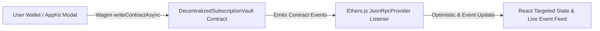

# 🚀 Ethers.js Masterclass: Decentralized Subscription Vault & Recurrent Payroll

[](https://sepolia.etherscan.io/address/0x683C2a1cd368803361A63ABc342AB35690D2B3dB#code)
[](https://cloud.reown.com)
[](https://wagmi.sh)
[](https://docs.ethers.org/v6/)

Welcome to the **Master Challenge #4** for the Frontend Web3 Masterclass! In this project, you will build and integrate a production-ready **Decentralized Autonomous Subscription & Streaming Recurrent Payment Vault** (`ethers-masterclass-subscriptions`).

This project solves a real-world Web3 pain point: **How to manage SaaS subscriptions and automated payroll in Web3 without forcing users to manually sign transaction approvals every single month.**

---

## ⚡ Deployed Smart Contracts

Students do **NOT** need to deploy contracts to test or finish this project! Pre-deployed and verified smart contracts on Sepolia testnet are provided out of the box:

| Network | Contract Name | Address | Etherscan Link |
| :--- | :--- | :--- | :--- |
| **Sepolia Testnet** | `DecentralizedSubscriptionVault` | `0x683C2a1cd368803361A63ABc342AB35690D2B3dB` | [View Code & Transactions](https://sepolia.etherscan.io/address/0x683C2a1cd368803361A63ABc342AB35690D2B3dB#code) |

---

## 💡 Key Architectural Challenge: Wagmi + Ethers.js Hybrid Integration

In professional Web3 frontend engineering, different tools excel at different tasks:

1. **Reown AppKit & Wagmi v2**: Used for modern multi-wallet connection modals, chain switching, and user transaction signing (`subscribe`, `cancelSubscription`).
2. **Ethers.js v6**: Used for low-latency JSON-RPC provider instantiation and real-time smart contract event listening (`contract.on('PaymentExecuted', ...)`).



---

## ⚡ Core Assessment Criterion: Event-Driven & Optimistic Updates

> **Crucial Rule**: Students are evaluated on avoiding expensive full-state RPC refetches!

- ❌ **Anti-Pattern (Failed Grade)**: Calling `fetchPlans()` every time a transaction confirms. Querying all contract storage after each transaction causes unnecessary network latency, exhausts RPC rate limits, and freezes the UI.
- ✅ **Production Pattern (Full Marks)**: Fetch all plans **once** on initial page load. When transactions confirm, use **Ethers.js event listeners** (`PaymentExecuted`, `Subscribed`, `SubscriptionCancelled`) and/or **optimistic state updates** to update only the specific plan concerned and append to the live event feed.

---

## ⏳ 3-Hour Challenge Roadmap

### 🎯 Hour 1: Contract Analysis & Local Setup
- [ ] Clone repository & inspect [`contracts/DecentralizedSubscriptionVault.sol`](./contracts/DecentralizedSubscriptionVault.sol).
- [ ] Understand `PlanCreated`, `Subscribed`, and `PaymentExecuted` event structures.
- [ ] Configure `.env` and `web3ModalConfig.ts` with your Reown AppKit Project ID from [cloud.reown.com](https://cloud.reown.com).

### 🎯 Hour 2: AppKit & Wagmi Wallet Modal Integration
- [ ] Setup Wagmi configuration in `frontend/src/contracts/web3ModalConfig.ts`.
- [ ] Test `<w3m-button />` in `frontend/src/components/Header.tsx`.
- [ ] Implement `subscribeToPlan` and `cancelSubscription` via Wagmi `writeContractAsync` in `frontend/src/hooks/useSubscriptionVault.ts`.

### 🎯 Hour 3: Ethers.js Real-time Event Listener & UI Stream
- [ ] Initialize an Ethers `JsonRpcProvider` inside the `useEffect` hook in `frontend/src/hooks/useSubscriptionVault.ts`.
- [ ] Attach the real-time event listener: `vaultContract.on('PaymentExecuted', ...)`.
- [ ] Implement on-chain plan fetching with `vaultContract.getAllPlans()`.
- [ ] Test the live streaming payment activity in `frontend/src/components/EventFeed.tsx`.

---

## 🛠️ Quickstart Instructions

### 1. Install Dependencies
```bash
# Install backend / hardhat dependencies
npm install

# Install frontend dependencies
cd frontend
npm install --ignore-scripts --legacy-peer-deps
```

### 2. Configure Environment Variables
Copy `.env.example` in the root and add your keys:
```env
SEPOLIA_RPC_URL="https://ethereum-sepolia-rpc.publicnode.com"
PRIVATE_KEY="your_private_key"
```

In `frontend/src/contracts/web3ModalConfig.ts`, update your Reown AppKit Project ID:
```typescript
export const projectId = 'YOUR_APPKIT_PROJECT_ID';
```

### 3. Run Development Server
```bash
cd frontend
npm run dev
```

Open `http://localhost:3000` in your browser.

---

## 🧪 Testing Smart Contracts Locally

If you'd like to test or modify the Solidity smart contracts locally with Hardhat:

```bash
# Run local Hardhat node
npm run node

# In a new terminal, deploy contracts to local node
npm run deploy:localhost

# Run smart contract unit tests
npm run test
```

---

## 🎨 Design System Principles

This frontend follows a **Cyberpunk / Raycast Dark Paper + Vibrant Orange** Web3 visual identity:
- **Surface**: Charcoal Paper Dark (`#121316` & `#16171B`) with elevated cards (`#1D1E24`).
- **Typography**: Inter Sans-Serif paired with JetBrains Mono for addresses and balances.
- **Accents**: Vibrant Orange (`#F97316` / `#EA580C`) for active badges, CTAs, and glowing brand marks.
- **Borders**: Micro paper borders (`#2E313A`) with subtle dark shadows.

---

## 🎓 Learning Outcomes
By completing this challenge, students will master:
1. Dual-stack integration of **Wagmi v2** and **Ethers.js v6**.
2. Real-time EVM event stream handling without unnecessary UI refetches.
3. Clean TypeScript architecture for Web3 SaaS products.
